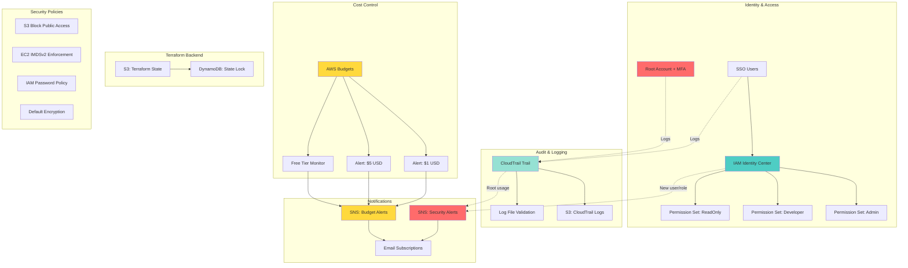

# Design Document: AWS Account Security Setup

## Overview

Este diseño técnico define la implementación de una configuración de seguridad para una cuenta AWS nueva, utilizando EXCLUSIVAMENTE servicios 100% gratuitos. La solución está diseñada para un presupuesto de $0 con alertas configuradas a $1 y $5 USD, y utiliza Terraform como herramienta de Infrastructure as Code.

### Objetivos del Diseño

1. **Seguridad desde el inicio**: Implementar controles de seguridad fundamentales sin costos
2. **Gobierno de accesos**: Utilizar IAM Identity Center (SSO) para gestión centralizada
3. **Auditoría completa**: Registrar todas las actividades con CloudTrail (primer trail gratis)
4. **Control de costos**: Monitorear gastos y uso de Free Tier con AWS Budgets
5. **Infraestructura como código**: Gestionar toda la configuración con Terraform
6. **Escalabilidad**: Preparar la cuenta para crecimiento futuro sin costos adicionales

### Alcance

**Incluido en este diseño:**
- IAM Identity Center con 3 Permission Sets (Admin, Developer, ReadOnly)
- CloudTrail con un trail para eventos de gestión (gratis)
- AWS Budgets con alertas a $1 y $5 USD
- S3 buckets para logs de CloudTrail y Terraform state
- DynamoDB para Terraform state locking
- SNS topics para notificaciones de seguridad y presupuesto
- Políticas de seguridad a nivel de cuenta (S3 block public access, password policy, IMDSv2)
- Configuración de backend remoto de Terraform

**Excluido (por costos):**
- AWS Config (no incluido en Free Tier permanente)
- Amazon GuardDuty (costo después de 30 días de prueba)
- AWS Security Hub (costo después de 30 días de prueba)
- AWS Organizations (no necesario para cuenta única)
- Múltiples trails de CloudTrail (solo el primero es gratis)

### Restricciones

1. **Presupuesto**: $0 con alertas a $1 y $5 USD
2. **Servicios**: Solo servicios 100% gratuitos dentro de Free Tier
3. **Región primaria**: us-east-1 (flexible a otras regiones)
4. **Herramienta IaC**: Terraform exclusivamente
5. **Límites de Free Tier**:
   - CloudTrail: 1 trail gratis para management events
   - S3: 5GB de almacenamiento estándar
   - DynamoDB: 25GB de almacenamiento, 25 WCU/RCU
   - SNS: 1000 notificaciones email por mes
   - AWS Budgets: 2 budgets gratis


## Architecture

### High-Level Architecture



### Component Interaction Flow

**1. User Authentication Flow:**
```
User → IAM Identity Center → MFA Challenge → Permission Set → AWS Resources
```

**2. Audit Flow:**
```
API Call → CloudTrail → S3 Bucket (encrypted) → Log File Validation
```

**3. Cost Alert Flow:**
```
AWS Usage → Budgets Service → Threshold Check → SNS Topic → Email Notification
```

**4. Terraform Deployment Flow:**
```
Terraform Plan → State Lock (DynamoDB) → Apply Changes → Update State (S3) → Release Lock
```

### Regional Architecture

**Primary Region: us-east-1**
- IAM Identity Center (global service)
- CloudTrail (multi-region trail)
- S3 buckets (us-east-1)
- DynamoDB table (us-east-1)
- SNS topics (us-east-1)
- AWS Budgets (global service)

**Rationale for us-east-1:**
- Región con mayor disponibilidad de servicios
- Costos generalmente más bajos
- Mejor documentación y soporte
- Usuario tiene experiencia en esta región


## Components and Interfaces

### 1. IAM Identity Center (SSO)

**Purpose**: Gestión centralizada de acceso con experiencia de Single Sign-On.

**Configuration:**
- **Identity Source**: AWS managed directory (incluido en Free Tier)
- **MFA Enforcement**: Obligatorio para todos los usuarios
- **Session Duration**: 8 horas (configurable)

**Permission Sets:**

1. **AdminPermissionSet**
   - Managed Policy: `AdministratorAccess`
   - Use Case: Administración completa de la cuenta
   - Session Duration: 4 horas
   - MFA: Required

2. **DeveloperPermissionSet**
   - Managed Policies:
     - `PowerUserAccess` (base)
     - Custom inline policy para denegar cambios en IAM, Budgets, CloudTrail
   - Use Case: Desarrollo y despliegue de aplicaciones
   - Session Duration: 8 horas
   - MFA: Required

3. **ReadOnlyPermissionSet**
   - Managed Policy: `ReadOnlyAccess`
   - Use Case: Auditoría y consulta sin modificaciones
   - Session Duration: 12 horas
   - MFA: Required

**Terraform Resources:**
```hcl
# Módulo: modules/iam-identity-center
resource "aws_ssoadmin_permission_set" "admin"
resource "aws_ssoadmin_permission_set" "developer"
resource "aws_ssoadmin_permission_set" "readonly"
resource "aws_ssoadmin_managed_policy_attachment"
resource "aws_ssoadmin_permission_set_inline_policy"
```

### 2. CloudTrail

**Purpose**: Auditoría de todas las llamadas a la API de AWS.

**Configuration:**
- **Trail Name**: `account-audit-trail`
- **Trail Type**: Multi-region trail
- **Event Type**: Management events only (gratis)
- **Log File Validation**: Enabled
- **S3 Bucket**: `<account-id>-cloudtrail-logs-us-east-1`
- **Encryption**: SSE-S3 (AES-256)
- **Versioning**: Enabled

**Log Retention:**
- S3 Lifecycle Policy: Delete after 90 days
- Estimated Storage: ~1-2 GB/month (dentro de 5GB Free Tier)

**Terraform Resources:**
```hcl
# Módulo: modules/cloudtrail
resource "aws_cloudtrail" "main"
resource "aws_s3_bucket" "cloudtrail_logs"
resource "aws_s3_bucket_versioning"
resource "aws_s3_bucket_lifecycle_configuration"
resource "aws_s3_bucket_public_access_block"
resource "aws_s3_bucket_server_side_encryption_configuration"
resource "aws_s3_bucket_policy" # Allow CloudTrail to write
```

### 3. AWS Budgets

**Purpose**: Monitoreo de costos y alertas tempranas.

**Budget Configuration:**
- **Budget Name**: `zero-dollar-budget`
- **Budget Amount**: $0.00 USD
- **Budget Type**: Cost budget
- **Time Period**: Monthly recurring
- **Include**: All AWS services
- **Exclude**: Credits, refunds, taxes

**Alerts:**

1. **Forecasted Alert ($5 USD)**
   - Type: Forecasted
   - Threshold: $5.00 USD
   - Notification: SNS topic `budget-alerts`

2. **Actual Alert ($1 USD)**
   - Type: Actual
   - Threshold: $1.00 USD (100% over budget)
   - Notification: SNS topic `budget-alerts`

3. **Actual Alert ($5 USD)**
   - Type: Actual
   - Threshold: $5.00 USD (500% over budget)
   - Notification: SNS topic `budget-alerts`

**Free Tier Monitoring:**
- Separate budget for tracking Free Tier usage
- Alerts at 80% of key service limits (S3, DynamoDB)

**Terraform Resources:**
```hcl
# Módulo: modules/budgets
resource "aws_budgets_budget" "zero_dollar"
resource "aws_budgets_budget" "free_tier_monitor"
```

### 4. S3 Buckets

**Purpose**: Almacenamiento de logs y Terraform state.

**Bucket 1: CloudTrail Logs**
- **Name**: `<account-id>-cloudtrail-logs-us-east-1`
- **Versioning**: Enabled
- **Encryption**: SSE-S3 (AES-256)
- **Public Access**: Blocked (all 4 settings)
- **Lifecycle**: Delete objects after 90 days
- **Bucket Policy**: Allow CloudTrail service to write

**Bucket 2: Terraform State**
- **Name**: `<account-id>-terraform-state-us-east-1`
- **Versioning**: Enabled (critical for state recovery)
- **Encryption**: SSE-S3 (AES-256)
- **Public Access**: Blocked (all 4 settings)
- **Lifecycle**: Keep all versions for 30 days, then delete old versions
- **Bucket Policy**: Restrict access to specific IAM roles

**Terraform Resources:**
```hcl
# Módulo: modules/s3-buckets
resource "aws_s3_bucket" "cloudtrail_logs"
resource "aws_s3_bucket" "terraform_state"
resource "aws_s3_bucket_versioning"
resource "aws_s3_bucket_server_side_encryption_configuration"
resource "aws_s3_bucket_public_access_block"
resource "aws_s3_bucket_lifecycle_configuration"
resource "aws_s3_bucket_policy"
```

### 5. DynamoDB Table

**Purpose**: State locking para Terraform (prevenir modificaciones concurrentes).

**Configuration:**
- **Table Name**: `terraform-state-lock`
- **Billing Mode**: On-demand (pay per request, dentro de Free Tier)
- **Partition Key**: `LockID` (String)
- **Encryption**: AWS managed key (default)
- **Point-in-time Recovery**: Disabled (costo adicional)
- **Estimated Usage**: <1 WCU/RCU por deployment (muy dentro de 25 WCU/RCU gratis)

**Terraform Resources:**
```hcl
# Módulo: modules/dynamodb
resource "aws_dynamodb_table" "terraform_lock"
```

### 6. SNS Topics

**Purpose**: Notificaciones de eventos de seguridad y presupuesto.

**Topic 1: Security Alerts**
- **Name**: `security-alerts`
- **Use Cases**:
  - Root account usage
  - New IAM user/role creation
  - Permission set changes
  - CloudTrail configuration changes
- **Subscriptions**: Email (configurable)
- **Estimated Volume**: <50 notifications/month

**Topic 2: Budget Alerts**
- **Name**: `budget-alerts`
- **Use Cases**:
  - Budget threshold exceeded
  - Free Tier usage warnings
  - Cost anomalies
- **Subscriptions**: Email (configurable)
- **Estimated Volume**: <20 notifications/month

**Total SNS Usage**: ~70 emails/month (dentro de 1000 gratis)

**Terraform Resources:**
```hcl
# Módulo: modules/sns
resource "aws_sns_topic" "security_alerts"
resource "aws_sns_topic" "budget_alerts"
resource "aws_sns_topic_subscription" # Email subscriptions
```

### 7. Account-Level Security Policies

**Purpose**: Controles de seguridad preventivos a nivel de cuenta.

**S3 Block Public Access (Account Level)**
- Block public ACLs: true
- Ignore public ACLs: true
- Block public bucket policies: true
- Restrict public buckets: true

**IAM Password Policy**
- Minimum length: 14 characters
- Require uppercase: true
- Require lowercase: true
- Require numbers: true
- Require symbols: true
- Allow users to change: true
- Password expiration: 90 days
- Password reuse prevention: 5 passwords

**EC2 IMDSv2 Enforcement**
- Require IMDSv2 for all new instances
- Implemented via Service Control Policy (SCP) simulation in IAM policy

**Default Encryption**
- S3: SSE-S3 (AES-256) by default
- EBS: Encryption enabled by default (when available in Free Tier)

**Terraform Resources:**
```hcl
# Módulo: modules/account-security
resource "aws_s3_account_public_access_block"
resource "aws_iam_account_password_policy"
# IMDSv2 enforcement via IAM policies on roles
```

### 8. Terraform Backend Configuration

**Purpose**: Almacenamiento remoto y seguro del estado de Terraform.

**Backend Configuration:**
```hcl
terraform {
  backend "s3" {
    bucket         = "<account-id>-terraform-state-us-east-1"
    key            = "aws-account-security/terraform.tfstate"
    region         = "us-east-1"
    encrypt        = true
    dynamodb_table = "terraform-state-lock"
  }
}
```

**Bootstrap Process:**
1. Initial deployment uses local backend
2. Create S3 bucket and DynamoDB table
3. Migrate state to remote backend
4. All subsequent operations use remote backend

**State Management:**
- Versioning enabled for rollback capability
- Encryption at rest with SSE-S3
- State locking prevents concurrent modifications
- Access restricted to specific IAM roles


## Data Models

### Terraform Module Structure

```
terraform/
├── main.tf                          # Root module orchestration
├── variables.tf                     # Input variables
├── outputs.tf                       # Output values
├── providers.tf                     # Provider configuration
├── backend.tf                       # Backend configuration (after bootstrap)
├── terraform.tfvars.example         # Example variable values
├── README.md                        # Documentation
│
├── bootstrap/                       # Initial setup (local backend)
│   ├── main.tf                      # S3 + DynamoDB creation
│   ├── variables.tf
│   └── outputs.tf
│
└── modules/
    ├── iam-identity-center/         # IAM Identity Center configuration
    │   ├── main.tf
    │   ├── variables.tf
    │   ├── outputs.tf
    │   └── permission-sets.tf
    │
    ├── cloudtrail/                  # CloudTrail and logging
    │   ├── main.tf
    │   ├── variables.tf
    │   ├── outputs.tf
    │   ├── trail.tf
    │   └── s3-bucket.tf
    │
    ├── budgets/                     # AWS Budgets and alerts
    │   ├── main.tf
    │   ├── variables.tf
    │   ├── outputs.tf
    │   ├── cost-budget.tf
    │   └── free-tier-budget.tf
    │
    ├── s3-backend/                  # Terraform state backend
    │   ├── main.tf
    │   ├── variables.tf
    │   ├── outputs.tf
    │   ├── s3-bucket.tf
    │   └── dynamodb-table.tf
    │
    ├── sns-notifications/           # SNS topics and subscriptions
    │   ├── main.tf
    │   ├── variables.tf
    │   ├── outputs.tf
    │   └── topics.tf
    │
    └── account-security/            # Account-level security policies
        ├── main.tf
        ├── variables.tf
        ├── outputs.tf
        ├── s3-block-public.tf
        ├── iam-password-policy.tf
        └── ec2-imdsv2.tf
```

### Terraform Variable Schema

**Root Module Variables:**
```hcl
variable "aws_region" {
  description = "AWS region for resources"
  type        = string
  default     = "us-east-1"
}

variable "account_id" {
  description = "AWS account ID"
  type        = string
}

variable "project_name" {
  description = "Project name for resource naming"
  type        = string
  default     = "aws-security-setup"
}

variable "environment" {
  description = "Environment name"
  type        = string
  default     = "production"
}

variable "budget_alert_emails" {
  description = "Email addresses for budget alerts"
  type        = list(string)
}

variable "security_alert_emails" {
  description = "Email addresses for security alerts"
  type        = list(string)
}

variable "cloudtrail_log_retention_days" {
  description = "Days to retain CloudTrail logs"
  type        = number
  default     = 90
}

variable "enable_mfa_enforcement" {
  description = "Enforce MFA for IAM Identity Center"
  type        = bool
  default     = true
}

variable "tags" {
  description = "Common tags for all resources"
  type        = map(string)
  default = {
    ManagedBy   = "Terraform"
    Project     = "AWS-Security-Setup"
    Environment = "Production"
  }
}
```

### IAM Identity Center Data Model

**Permission Set Structure:**
```hcl
# Admin Permission Set
{
  name             = "AdminPermissionSet"
  description      = "Full administrative access"
  session_duration = "PT4H"  # 4 hours
  managed_policies = [
    "arn:aws:iam::aws:policy/AdministratorAccess"
  ]
  inline_policy    = null
  tags = {
    AccessLevel = "Admin"
    MFARequired = "true"
  }
}

# Developer Permission Set
{
  name             = "DeveloperPermissionSet"
  description      = "Developer access with IAM restrictions"
  session_duration = "PT8H"  # 8 hours
  managed_policies = [
    "arn:aws:iam::aws:policy/PowerUserAccess"
  ]
  inline_policy = jsonencode({
    Version = "2012-10-17"
    Statement = [
      {
        Effect = "Deny"
        Action = [
          "iam:*",
          "organizations:*",
          "account:*",
          "budgets:*",
          "cloudtrail:DeleteTrail",
          "cloudtrail:StopLogging",
          "cloudtrail:UpdateTrail"
        ]
        Resource = "*"
      }
    ]
  })
  tags = {
    AccessLevel = "Developer"
    MFARequired = "true"
  }
}

# ReadOnly Permission Set
{
  name             = "ReadOnlyPermissionSet"
  description      = "Read-only access across all services"
  session_duration = "PT12H"  # 12 hours
  managed_policies = [
    "arn:aws:iam::aws:policy/ReadOnlyAccess"
  ]
  inline_policy    = null
  tags = {
    AccessLevel = "ReadOnly"
    MFARequired = "true"
  }
}
```

### CloudTrail Configuration Model

```hcl
{
  trail_name                        = "account-audit-trail"
  s3_bucket_name                    = "${var.account_id}-cloudtrail-logs-${var.aws_region}"
  include_global_service_events     = true
  is_multi_region_trail             = true
  enable_log_file_validation        = true
  enable_logging                    = true
  
  event_selector = {
    read_write_type           = "All"
    include_management_events = true
    
    data_resource = []  # Empty to stay in free tier
  }
  
  s3_bucket_config = {
    versioning_enabled = true
    encryption_type    = "AES256"
    lifecycle_rules = [
      {
        id      = "delete-old-logs"
        enabled = true
        expiration = {
          days = 90
        }
      }
    ]
    public_access_block = {
      block_public_acls       = true
      block_public_policy     = true
      ignore_public_acls      = true
      restrict_public_buckets = true
    }
  }
}
```

### Budget Configuration Model

```hcl
# Zero Dollar Budget
{
  budget_name  = "zero-dollar-budget"
  budget_type  = "COST"
  limit_amount = "0.0"
  limit_unit   = "USD"
  time_unit    = "MONTHLY"
  
  notifications = [
    {
      comparison_operator = "GREATER_THAN"
      threshold           = 500.0  # 500% of $0 = $5 forecasted
      threshold_type      = "PERCENTAGE"
      notification_type   = "FORECASTED"
      subscriber_sns_topic_arns = [aws_sns_topic.budget_alerts.arn]
    },
    {
      comparison_operator = "GREATER_THAN"
      threshold           = 100.0  # $1 actual
      threshold_type      = "ABSOLUTE_VALUE"
      notification_type   = "ACTUAL"
      subscriber_sns_topic_arns = [aws_sns_topic.budget_alerts.arn]
    },
    {
      comparison_operator = "GREATER_THAN"
      threshold           = 5.0    # $5 actual
      threshold_type      = "ABSOLUTE_VALUE"
      notification_type   = "ACTUAL"
      subscriber_sns_topic_arns = [aws_sns_topic.budget_alerts.arn]
    }
  ]
}

# Free Tier Usage Budget
{
  budget_name = "free-tier-usage-monitor"
  budget_type = "USAGE"
  time_unit   = "MONTHLY"
  
  cost_filters = {
    Service = ["Amazon Simple Storage Service", "Amazon DynamoDB"]
  }
  
  notifications = [
    {
      comparison_operator = "GREATER_THAN"
      threshold           = 80.0  # 80% of free tier
      threshold_type      = "PERCENTAGE"
      notification_type   = "ACTUAL"
      subscriber_sns_topic_arns = [aws_sns_topic.budget_alerts.arn]
    }
  ]
}
```

### SNS Topic Configuration Model

```hcl
# Security Alerts Topic
{
  topic_name   = "security-alerts"
  display_name = "AWS Security Alerts"
  
  subscriptions = [
    {
      protocol = "email"
      endpoint = var.security_alert_emails[0]
    }
  ]
  
  policy = {
    Version = "2012-10-17"
    Statement = [
      {
        Effect = "Allow"
        Principal = {
          Service = "cloudtrail.amazonaws.com"
        }
        Action   = "SNS:Publish"
        Resource = "arn:aws:sns:${var.aws_region}:${var.account_id}:security-alerts"
      }
    ]
  }
}

# Budget Alerts Topic
{
  topic_name   = "budget-alerts"
  display_name = "AWS Budget Alerts"
  
  subscriptions = [
    {
      protocol = "email"
      endpoint = var.budget_alert_emails[0]
    }
  ]
  
  policy = {
    Version = "2012-10-17"
    Statement = [
      {
        Effect = "Allow"
        Principal = {
          Service = "budgets.amazonaws.com"
        }
        Action   = "SNS:Publish"
        Resource = "arn:aws:sns:${var.aws_region}:${var.account_id}:budget-alerts"
      }
    ]
  }
}
```

### Resource Tagging Schema

**Standard Tags (Applied to All Resources):**
```hcl
{
  ManagedBy   = "Terraform"
  Project     = "AWS-Security-Setup"
  Environment = "Production"
  Owner       = var.owner_email
  CostCenter  = "Infrastructure"
  Compliance  = "SecurityBaseline"
}
```

**Resource-Specific Tags:**
```hcl
# CloudTrail
{
  Purpose      = "Audit"
  DataClass    = "Logs"
  Retention    = "90days"
}

# S3 Buckets
{
  Purpose      = "TerraformState" | "AuditLogs"
  DataClass    = "Infrastructure" | "Logs"
  Encryption   = "AES256"
}

# IAM Identity Center
{
  AccessLevel  = "Admin" | "Developer" | "ReadOnly"
  MFARequired  = "true"
}
```

### State File Structure

**Terraform State Schema:**
```json
{
  "version": 4,
  "terraform_version": "1.6.0",
  "serial": 1,
  "lineage": "unique-id",
  "outputs": {
    "cloudtrail_arn": {
      "value": "arn:aws:cloudtrail:...",
      "type": "string"
    },
    "terraform_state_bucket": {
      "value": "account-id-terraform-state-us-east-1",
      "type": "string"
    }
  },
  "resources": [
    {
      "mode": "managed",
      "type": "aws_cloudtrail",
      "name": "main",
      "provider": "provider[\"registry.terraform.io/hashicorp/aws\"]",
      "instances": [...]
    }
  ]
}
```

### DynamoDB Lock Table Schema

**Table Structure:**
```
Table Name: terraform-state-lock
Partition Key: LockID (String)

Item Structure:
{
  "LockID": "account-id-terraform-state-us-east-1/aws-account-security/terraform.tfstate",
  "Info": "{\"ID\":\"...\",\"Operation\":\"OperationTypeApply\",\"Who\":\"user@example.com\",\"Version\":\"1.6.0\",\"Created\":\"2024-01-15T10:30:00Z\",\"Path\":\"...\"}",
  "Digest": "abc123..."
}
```


## Correctness Properties

*A property is a characteristic or behavior that should hold true across all valid executions of a system-essentially, a formal statement about what the system should do. Properties serve as the bridge between human-readable specifications and machine-verifiable correctness guarantees.*

Para este proyecto de Infrastructure as Code, las propiedades de corrección se enfocan en invariantes de configuración que deben mantenerse a través de todos los recursos creados. Dado que estamos definiendo infraestructura declarativa, las propiedades verifican que las configuraciones cumplan con los estándares de seguridad establecidos.

### Property 1: CloudTrail Management Events Coverage

*For any* API call made to AWS services (including root account usage), CloudTrail shall capture and log the management event to the configured S3 bucket.

**Validates: Requirements 1.2, 3.7**

**Rationale**: Esta propiedad asegura que CloudTrail está configurado correctamente para capturar TODOS los eventos de gestión, incluyendo el uso crítico de la cuenta root. La configuración debe incluir:
- Trail habilitado y activo
- Multi-region trail para capturar eventos en todas las regiones
- Management events incluidos
- Destino S3 configurado correctamente

**Testing Approach**: Verificar que la configuración de Terraform incluye:
- `enable_logging = true`
- `is_multi_region_trail = true`
- `include_global_service_events = true`
- Event selector configurado para management events

### Property 2: S3 Bucket Encryption Enforcement

*For any* S3 bucket created por esta configuración de Terraform, el bucket debe tener encriptación habilitada con AES-256 (SSE-S3) como mínimo.

**Validates: Requirements 5.2, 6.3**

**Rationale**: La encriptación en reposo es un control de seguridad fundamental. Todos los buckets (CloudTrail logs, Terraform state) deben estar encriptados para proteger datos sensibles. Esta propiedad asegura que no se creen buckets sin encriptación.

**Testing Approach**: Para cada recurso `aws_s3_bucket` en la configuración:
- Verificar que existe un recurso `aws_s3_bucket_server_side_encryption_configuration` asociado
- Verificar que el algoritmo es "AES256" o superior
- Verificar que la regla de encriptación está aplicada

### Property 3: Resource Tagging Compliance

*For any* recurso AWS creado por esta configuración de Terraform, el recurso debe incluir los tags obligatorios: `ManagedBy`, `Project`, `Environment`, y `Owner`.

**Validates: Requirements 6.7**

**Rationale**: El etiquetado consistente es esencial para:
- Gestión de costos y atribución
- Auditoría y compliance
- Automatización y filtrado de recursos
- Identificación de ownership

Esta propiedad asegura que todos los recursos son rastreables y gestionables.

**Testing Approach**: Para cada recurso que soporte tags en la configuración de Terraform:
- Verificar que el bloque `tags` existe
- Verificar que contiene las claves: `ManagedBy`, `Project`, `Environment`
- Verificar que los valores no están vacíos

### Configuration Validation Examples

Además de las propiedades universales, las siguientes configuraciones específicas deben ser validadas como ejemplos concretos:

**IAM Identity Center Configuration:**
- Admin Permission Set exists with AdministratorAccess policy (Req 2.3)
- Developer Permission Set exists with PowerUserAccess and IAM restrictions (Req 2.4)
- ReadOnly Permission Set exists with ReadOnlyAccess policy (Req 2.5)
- MFA enforcement is enabled (Req 2.6)
- AWS managed directory is configured as identity source (Req 2.7)

**CloudTrail Configuration:**
- Exactly one trail is configured (Req 3.1)
- Trail logs to S3 bucket (Req 3.2)
- Log file validation is enabled (Req 3.3)
- Multi-region trail is enabled (Req 3.4)
- S3 bucket has versioning enabled (Req 3.5)
- S3 bucket blocks all public access (Req 3.6)

**Budget Configuration:**
- Zero-dollar budget exists with $0 amount (Req 4.1)
- Forecasted alert at $5 USD exists (Req 4.2)
- Actual alert at $1 USD exists (Req 4.3)
- Actual alert at $5 USD exists (Req 4.4)
- SNS topic for budget alerts exists (Req 4.5)
- Free tier usage budget monitors S3, DynamoDB (Req 4.6)
- Free tier alert at 80% threshold exists (Req 4.7)

**Account Security Configuration:**
- S3 account-level public access block is enabled (all 4 settings) (Req 5.1)
- IAM password policy requires 14+ characters with complexity (Req 5.6)
- IAM policies include IMDSv2 requirements for EC2 (Req 5.4)

**Terraform Backend Configuration:**
- S3 bucket for state exists (Req 6.1)
- State bucket has versioning enabled (Req 6.2)
- State bucket has encryption enabled (Req 6.3)
- DynamoDB table for locking exists (Req 6.4)
- DynamoDB table uses on-demand billing (Req 6.5)

**Log Retention Configuration:**
- CloudTrail logs have 90-day lifecycle policy (Req 7.1, 7.2)

**SNS Configuration:**
- Security alerts SNS topic exists (Req 8.1)
- Budget alerts SNS topic exists (Req 8.2)
- SNS subscriptions use email protocol (Req 8.3)
- Budget notifications are linked to SNS topic (Req 8.6)


## Error Handling

### Terraform Execution Errors

**1. State Lock Conflicts**

**Scenario**: Múltiples usuarios intentan ejecutar `terraform apply` simultáneamente.

**Handling**:
- DynamoDB state locking previene modificaciones concurrentes
- Terraform muestra error claro: "Error acquiring the state lock"
- Usuario debe esperar a que el lock se libere (timeout: 10 minutos)
- Si el proceso anterior falló, usar `terraform force-unlock <lock-id>`

**Prevention**:
- Documentar proceso de coordinación entre usuarios
- Usar CI/CD pipeline para centralizas deployments
- Implementar proceso de revisión antes de apply

**2. AWS API Rate Limiting**

**Scenario**: Terraform hace demasiadas llamadas a la API de AWS en corto tiempo.

**Handling**:
- Terraform automáticamente reintenta con exponential backoff
- Si persiste, el apply falla con error de rate limiting
- Usuario debe esperar y reintentar

**Prevention**:
- Usar `terraform plan` antes de apply para validar cambios
- Dividir cambios grandes en múltiples applies más pequeños
- Evitar recrear recursos innecesariamente

**3. Insufficient Permissions**

**Scenario**: El usuario ejecutando Terraform no tiene permisos suficientes.

**Handling**:
- Terraform falla con error de Access Denied
- Error message indica qué acción y recurso fue denegado
- Usuario debe verificar sus permisos en IAM Identity Center

**Prevention**:
- Documentar permisos mínimos requeridos para deployment
- Usar Admin Permission Set para configuración inicial
- Validar permisos antes de ejecutar apply

**4. Resource Already Exists**

**Scenario**: Recurso que Terraform intenta crear ya existe (ej: bucket name collision).

**Handling**:
- Terraform falla con error "AlreadyExists" o "ResourceInUse"
- Usuario debe:
  - Importar el recurso existente: `terraform import`
  - O cambiar el nombre del recurso en la configuración

**Prevention**:
- Usar nombres únicos con account ID: `${var.account_id}-resource-name`
- Verificar recursos existentes antes de deployment
- Usar `terraform plan` para detectar conflictos

**5. Free Tier Limit Exceeded**

**Scenario**: Configuración excede límites de Free Tier (ej: múltiples trails de CloudTrail).

**Handling**:
- AWS rechaza la creación con error de límite excedido
- Terraform falla y muestra el error
- Usuario debe revisar y ajustar configuración

**Prevention**:
- Documentar límites de Free Tier claramente
- Validar configuración contra límites antes de apply
- Usar solo servicios y cantidades dentro de Free Tier

### AWS Service Errors

**6. SNS Subscription Confirmation Pending**

**Scenario**: SNS topic creado pero subscription email no confirmada.

**Handling**:
- Terraform crea el topic y subscription exitosamente
- Subscription queda en estado "PendingConfirmation"
- Usuario debe revisar email y confirmar subscription
- Notificaciones no se enviarán hasta confirmar

**Prevention**:
- Documentar proceso de confirmación de email
- Incluir paso manual en runbook de deployment
- Considerar usar subscriptions confirmadas automáticamente (ej: Lambda)

**7. CloudTrail S3 Bucket Policy Conflict**

**Scenario**: Bucket policy no permite a CloudTrail escribir logs.

**Handling**:
- CloudTrail se crea pero no puede escribir logs
- Error aparece en CloudTrail console: "Failed to deliver logs"
- Usuario debe verificar bucket policy

**Prevention**:
- Terraform configura bucket policy correctamente en el módulo
- Validar que el bucket policy incluye permisos para CloudTrail service
- Usar data source para obtener CloudTrail service principal correcto

**8. IAM Identity Center Not Enabled**

**Scenario**: IAM Identity Center no está habilitado en la cuenta.

**Handling**:
- Terraform falla al intentar crear permission sets
- Error indica que Identity Center no está disponible
- Usuario debe habilitar IAM Identity Center manualmente primero

**Prevention**:
- Documentar prerequisito de habilitar IAM Identity Center
- Incluir verificación en README
- Considerar usar AWS CLI para verificar antes de Terraform

### Budget and Cost Errors

**9. Budget Alert Email Not Received**

**Scenario**: Budget configurado pero alertas no llegan por email.

**Handling**:
- Verificar que SNS subscription está confirmada
- Verificar que email no está en spam
- Verificar que budget notification está vinculada al SNS topic correcto
- Revisar CloudWatch Logs para SNS delivery failures

**Prevention**:
- Confirmar SNS subscription inmediatamente después de deployment
- Agregar múltiples emails para redundancia
- Documentar troubleshooting steps

**10. Unexpected Costs Detected**

**Scenario**: Budget alert indica costos inesperados.

**Handling**:
- Revisar AWS Cost Explorer para identificar servicios con costo
- Verificar que no se crearon recursos fuera de Free Tier
- Revisar CloudTrail logs para identificar quién creó recursos
- Eliminar recursos no autorizados inmediatamente

**Prevention**:
- Configurar alertas tempranas ($1 USD)
- Revisar costos diariamente durante primeras semanas
- Educar usuarios sobre límites de Free Tier
- Usar AWS Budgets para monitorear uso de Free Tier

### State Management Errors

**11. Terraform State Corruption**

**Scenario**: State file se corrompe o se pierde.

**Handling**:
- Si S3 versioning está habilitado, restaurar versión anterior:
  ```bash
  aws s3api list-object-versions --bucket <bucket> --prefix terraform.tfstate
  aws s3api get-object --bucket <bucket> --key terraform.tfstate --version-id <version>
  ```
- Si no hay backup, recrear state con `terraform import` para cada recurso
- Último recurso: destruir y recrear infraestructura

**Prevention**:
- S3 versioning SIEMPRE habilitado (configurado en diseño)
- Backups regulares del state file
- Nunca editar state file manualmente
- Usar `terraform state` commands para modificaciones

**12. State Drift Detection**

**Scenario**: Recursos modificados manualmente fuera de Terraform.

**Handling**:
- Ejecutar `terraform plan` muestra diferencias
- Opciones:
  - Aplicar cambios de Terraform para revertir modificaciones manuales
  - Actualizar Terraform config para reflejar cambios manuales
  - Usar `terraform refresh` para actualizar state

**Prevention**:
- Documentar que TODOS los cambios deben hacerse via Terraform
- Usar IAM policies para restringir modificaciones manuales
- Ejecutar `terraform plan` regularmente para detectar drift

### Recovery Procedures

**Complete Infrastructure Recovery**:
1. Verificar que S3 state bucket y DynamoDB table existen
2. Restaurar última versión válida del state file
3. Ejecutar `terraform plan` para verificar estado
4. Si hay drift, decidir si aplicar cambios o actualizar config
5. Ejecutar `terraform apply` para reconciliar

**Partial Resource Recovery**:
1. Identificar recurso problemático
2. Remover del state: `terraform state rm <resource>`
3. Importar recurso existente: `terraform import <resource> <id>`
4. O recrear: `terraform apply`

**Emergency Rollback**:
1. Identificar última configuración válida en Git
2. Checkout a ese commit
3. Restaurar state file de esa versión desde S3
4. Ejecutar `terraform plan` para verificar
5. Ejecutar `terraform apply` para revertir cambios


## Testing Strategy

### Overview

La estrategia de testing para este proyecto de Infrastructure as Code combina dos enfoques complementarios:

1. **Unit Tests**: Validación de configuraciones específicas y ejemplos concretos
2. **Property-Based Tests**: Verificación de invariantes universales que deben cumplirse

Dado que estamos trabajando con Terraform (IaC declarativo), los tests se enfocan en validar la configuración antes del deployment, no el comportamiento en runtime.

### Testing Tools

**Primary Tool: Terratest (Go)**
- Framework de testing para Terraform
- Permite validar configuración y hacer deployments de prueba
- Integración con Go testing framework
- Soporte para property-based testing con gopter

**Alternative Tool: terraform-compliance (Python)**
- BDD-style testing para Terraform
- Validación de políticas de seguridad
- Más ligero que Terratest para validación de configuración

**Static Analysis: tflint**
- Linting de código Terraform
- Detección de errores de sintaxis y mejores prácticas
- Validación de tipos y valores

**Security Scanning: tfsec**
- Análisis de seguridad estático
- Detección de configuraciones inseguras
- Integración con CI/CD

### Unit Testing Approach

Los unit tests validan configuraciones específicas y casos concretos identificados en los acceptance criteria.

**Test Categories:**

**1. IAM Identity Center Tests**
```go
// Test: Admin Permission Set exists with correct policy
func TestAdminPermissionSetConfiguration(t *testing.T) {
    // Validate:
    // - Permission set named "AdminPermissionSet" exists
    // - Has AdministratorAccess managed policy attached
    // - Session duration is 4 hours (PT4H)
    // - MFA is required
}

// Test: Developer Permission Set has IAM restrictions
func TestDeveloperPermissionSetRestrictions(t *testing.T) {
    // Validate:
    // - Permission set named "DeveloperPermissionSet" exists
    // - Has PowerUserAccess managed policy
    // - Has inline policy denying IAM, budgets, cloudtrail changes
    // - Session duration is 8 hours
}

// Test: ReadOnly Permission Set configuration
func TestReadOnlyPermissionSetConfiguration(t *testing.T) {
    // Validate:
    // - Permission set named "ReadOnlyPermissionSet" exists
    // - Has ReadOnlyAccess managed policy
    // - Session duration is 12 hours
}
```

**2. CloudTrail Tests**
```go
// Test: CloudTrail trail configuration
func TestCloudTrailConfiguration(t *testing.T) {
    // Validate:
    // - Exactly one trail exists
    // - Trail is multi-region
    // - Management events are included
    // - Log file validation is enabled
    // - Logs to correct S3 bucket
}

// Test: CloudTrail S3 bucket security
func TestCloudTrailBucketSecurity(t *testing.T) {
    // Validate:
    // - Versioning is enabled
    // - All 4 public access block settings are true
    // - Encryption is configured (AES256)
    // - Lifecycle policy deletes logs after 90 days
}
```

**3. Budget Tests**
```go
// Test: Zero-dollar budget configuration
func TestZeroDollarBudget(t *testing.T) {
    // Validate:
    // - Budget exists with $0 amount
    // - Has forecasted alert at $5
    // - Has actual alert at $1
    // - Has actual alert at $5
    // - All alerts use correct SNS topic
}

// Test: Free tier monitoring budget
func TestFreeTierMonitoringBudget(t *testing.T) {
    // Validate:
    // - Usage budget exists
    // - Monitors S3 and DynamoDB services
    // - Has alert at 80% threshold
    // - Uses correct SNS topic
}
```

**4. Account Security Tests**
```go
// Test: S3 account-level public access block
func TestS3AccountPublicAccessBlock(t *testing.T) {
    // Validate all 4 settings are true:
    // - block_public_acls
    // - block_public_policy
    // - ignore_public_acls
    // - restrict_public_buckets
}

// Test: IAM password policy
func TestIAMPasswordPolicy(t *testing.T) {
    // Validate:
    // - Minimum length >= 14
    // - Require uppercase, lowercase, numbers, symbols
    // - Password expiration = 90 days
    // - Reuse prevention = 5 passwords
}
```

**5. Terraform Backend Tests**
```go
// Test: State bucket configuration
func TestTerraformStateBucket(t *testing.T) {
    // Validate:
    // - Bucket exists with correct name pattern
    // - Versioning is enabled
    // - Encryption is enabled (AES256)
    // - Public access is blocked
}

// Test: DynamoDB lock table configuration
func TestDynamoDBLockTable(t *testing.T) {
    // Validate:
    // - Table exists with correct name
    // - Partition key is "LockID" (String)
    // - Billing mode is "PAY_PER_REQUEST"
}
```

**6. SNS Tests**
```go
// Test: SNS topics exist
func TestSNSTopicsConfiguration(t *testing.T) {
    // Validate:
    // - security-alerts topic exists
    // - budget-alerts topic exists
    // - Both have email subscriptions configured
}
```

### Property-Based Testing Approach

Property-based tests verifican invariantes que deben cumplirse para TODOS los recursos del tipo especificado.

**Property Testing Library**: gopter (Go) o Hypothesis (Python)

**Configuration**: Minimum 100 iterations per property test

**Property 1: CloudTrail Management Events Coverage**

**Feature: aws-account-security-setup, Property 1: For any API call made to AWS services (including root account usage), CloudTrail shall capture and log the management event to the configured S3 bucket.**

```go
func TestProperty_CloudTrailCapturesAllManagementEvents(t *testing.T) {
    properties := gopter.NewProperties(nil)
    
    properties.Property("CloudTrail is configured to capture all management events", 
        prop.ForAll(
            func() bool {
                // Parse Terraform configuration
                config := parseTerraformConfig("../terraform")
                
                // Find CloudTrail resource
                trail := config.FindResource("aws_cloudtrail", "main")
                
                // Verify configuration
                return trail.Get("enable_logging").(bool) == true &&
                       trail.Get("is_multi_region_trail").(bool) == true &&
                       trail.Get("include_global_service_events").(bool) == true &&
                       trail.EventSelector().IncludeManagementEvents == true
            },
        ))
    
    properties.TestingRun(t, gopter.ConsoleReporter(false))
}
```

**Property 2: S3 Bucket Encryption Enforcement**

**Feature: aws-account-security-setup, Property 2: For any S3 bucket created by this Terraform configuration, the bucket must have encryption enabled with AES-256 (SSE-S3) as minimum.**

```go
func TestProperty_AllS3BucketsAreEncrypted(t *testing.T) {
    properties := gopter.NewProperties(nil)
    
    properties.Property("All S3 buckets have encryption enabled",
        prop.ForAll(
            func() bool {
                // Parse Terraform configuration
                config := parseTerraformConfig("../terraform")
                
                // Find all S3 bucket resources
                buckets := config.FindAllResources("aws_s3_bucket")
                
                // For each bucket, verify encryption is configured
                for _, bucket := range buckets {
                    bucketName := bucket.Name()
                    
                    // Find corresponding encryption configuration
                    encryption := config.FindResource(
                        "aws_s3_bucket_server_side_encryption_configuration",
                        bucketName,
                    )
                    
                    if encryption == nil {
                        return false
                    }
                    
                    // Verify algorithm is AES256 or better
                    algorithm := encryption.Get("rule.0.apply_server_side_encryption_by_default.0.sse_algorithm")
                    if algorithm != "AES256" && algorithm != "aws:kms" {
                        return false
                    }
                }
                
                return true
            },
        ))
    
    properties.TestingRun(t, gopter.ConsoleReporter(false))
}
```

**Property 3: Resource Tagging Compliance**

**Feature: aws-account-security-setup, Property 3: For any AWS resource created by this Terraform configuration, the resource must include the required tags: ManagedBy, Project, Environment, and Owner.**

```go
func TestProperty_AllResourcesHaveRequiredTags(t *testing.T) {
    properties := gopter.NewProperties(nil)
    
    requiredTags := []string{"ManagedBy", "Project", "Environment"}
    
    properties.Property("All resources have required tags",
        prop.ForAll(
            func() bool {
                // Parse Terraform configuration
                config := parseTerraformConfig("../terraform")
                
                // Find all resources that support tags
                taggableResources := config.FindAllTaggableResources()
                
                // For each resource, verify required tags exist
                for _, resource := range taggableResources {
                    tags := resource.Get("tags").(map[string]interface{})
                    
                    for _, requiredTag := range requiredTags {
                        value, exists := tags[requiredTag]
                        if !exists || value == "" {
                            return false
                        }
                    }
                }
                
                return true
            },
        ))
    
    properties.TestingRun(t, gopter.ConsoleReporter(false))
}
```

### Static Analysis and Security Scanning

**Pre-commit Hooks:**
```bash
# .pre-commit-config.yaml
repos:
  - repo: https://github.com/antonbabenko/pre-commit-terraform
    hooks:
      - id: terraform_fmt
      - id: terraform_validate
      - id: terraform_tflint
      - id: terraform_tfsec
```

**tflint Configuration:**
```hcl
# .tflint.hcl
plugin "aws" {
  enabled = true
  version = "0.21.0"
  source  = "github.com/terraform-linters/tflint-ruleset-aws"
}

rule "aws_resource_missing_tags" {
  enabled = true
  tags = ["ManagedBy", "Project", "Environment"]
}
```

**tfsec Checks:**
- S3 buckets have encryption
- S3 buckets block public access
- CloudTrail has log validation
- IAM password policy is strong
- DynamoDB tables have encryption

### Integration Testing

**Deployment Test (Optional - requires AWS account):**
```go
func TestTerraformDeployment(t *testing.T) {
    // This test actually deploys to AWS (use with caution)
    terraformOptions := &terraform.Options{
        TerraformDir: "../terraform",
        Vars: map[string]interface{}{
            "account_id": "123456789012",
            "aws_region": "us-east-1",
        },
    }
    
    // Clean up after test
    defer terraform.Destroy(t, terraformOptions)
    
    // Deploy infrastructure
    terraform.InitAndApply(t, terraformOptions)
    
    // Validate deployed resources
    // - CloudTrail is logging
    // - Budgets are active
    // - SNS topics exist
}
```

### CI/CD Pipeline Testing

**GitHub Actions Workflow:**
```yaml
name: Terraform Tests

on: [push, pull_request]

jobs:
  test:
    runs-on: ubuntu-latest
    steps:
      - uses: actions/checkout@v3
      
      - name: Setup Terraform
        uses: hashicorp/setup-terraform@v2
        
      - name: Terraform Format Check
        run: terraform fmt -check -recursive
        
      - name: Terraform Init
        run: terraform init -backend=false
        
      - name: Terraform Validate
        run: terraform validate
        
      - name: Run tflint
        run: tflint --recursive
        
      - name: Run tfsec
        run: tfsec .
        
      - name: Setup Go
        uses: actions/setup-go@v4
        
      - name: Run Unit Tests
        run: go test -v ./tests/unit/...
        
      - name: Run Property Tests
        run: go test -v ./tests/property/...
```

### Test Coverage Goals

- **Unit Tests**: 100% coverage of specific configuration requirements
- **Property Tests**: 100% coverage of universal invariants
- **Static Analysis**: Zero tflint warnings, zero tfsec high/critical issues
- **Integration Tests**: Optional, run manually before production deployment

### Testing Best Practices

1. **Run tests locally before commit**: Use pre-commit hooks
2. **Test in isolation**: Use separate AWS account for testing if doing integration tests
3. **Keep tests fast**: Unit and property tests should run in < 1 minute
4. **Document test failures**: Include clear error messages
5. **Version control test data**: Keep example tfvars in repo
6. **Automate in CI/CD**: Run all tests on every PR
7. **Review test results**: Don't merge if tests fail

### Manual Validation Checklist

After deployment, manually verify:
- [ ] Root account MFA is enabled (cannot be automated)
- [ ] SNS email subscriptions are confirmed
- [ ] CloudTrail is actively logging (check S3 bucket)
- [ ] Budget alerts are configured (check AWS Budgets console)
- [ ] IAM Identity Center users can login with MFA
- [ ] No unexpected costs in billing dashboard

